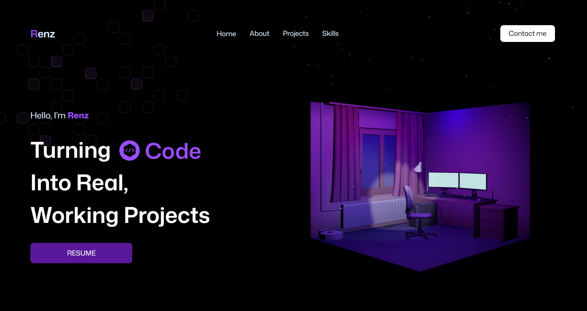

# Portfolio 🚀  

<p align="center">
  
</p>  

## 🛠 Tech Stack  
<p>
  
  
  
  
</p>  

---
## 📖 Introduction  
This is my personal **Portfolio Website**, designed to showcase my projects, skills, and experiences in an engaging and interactive way.  

The portfolio leverages **Three.js for 3D elements** and **GSAP for smooth animations**, combined with **React and Tailwind CSS** for a modern, responsive, and scalable frontend.  

---

## 📑 Table of Contents  
- [Introduction](#introduction)  
- [Features](#features)  
- [Quick Start](#quick-start)  
- [Project Structure](#project-structure)  
- [Screenshots](#screenshots)  
- [License](#license)  

---

## ✨ Features  
- 🎨 Beautiful and responsive design  
- 🌀 Smooth animations powered by **GSAP**  
- 🔥 Interactive **Three.js 3D graphics**  
- ⚡ Built with **React** for component-based architecture  
- 🎨 Styled with **Tailwind CSS** for utility-first design  
- 📱 Optimized for desktop and mobile  

---

## ⚡ Quick Start  

### 1. Clone the repository  
```bash
git clone https://github.com/yourusername/portfolio.git
cd portfolio
